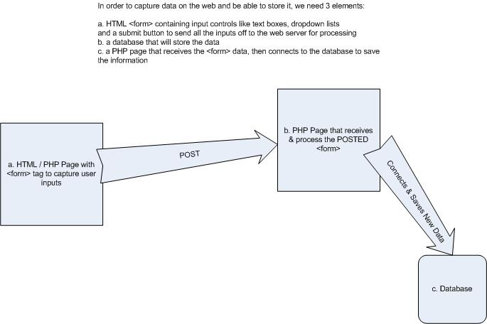

# COMP1006 - Intro to Web Programming
> Here's the notes from the class

> Professor : Rich Freeman

## Table of Contents

- [Week 2](#week-2)
- [Week 3](#week-3)


## week 2


### week 1 review

- Use the . operator to concatenate strings (NOT the + symbol)
- PHP code must be enclosed inside opening & closing PHP tags
- opening tag is ```" <?php"```
- closing tag is ```"?>"  ```
- PHP cannot run without a web server
- Open-source (free)
- Includes built-in functions we can use (e.g. phpinfo();)
- PHP is **loosely-typed**: variables do not have a specific data type and their values can change 
- from 1 type to another
- Very possibly to be replaced by JavaScript in the future
- Large database support for all types of databases
- Widely-used for content management systems including WordPress

### week 2 

single quote : php treats as a literal string

double quote : php treats php variables as php variables

double quote + html attributes (single quote)

- common errors

  - undefined index : the name attributes inside html must be the same inside php file ```['name attribute']```

  - always disconnect the db

    **it will let the user wait to connect to the website if there is no connection available.**

---


#### html form

- a set of `<form></form>` tags

- within the opening `<form>` tag, a method attribute with a value set to post:  

```php
method="POST"
```


- also within the opening `<form>` tag, a target attribute that tells the server which page to load next.  This page will process the form inputs: 

```php
<form action="save-person.php" method="POST">
```

- This 2nd page must have a `.php` extension in order to process the form inputs

```php
action="save-person.php"
```

- User input controls for each field we want from the user

```php
 <input name="name" id="name">
```

- A submit button to send the form values to the server for processing

```php
<button type="submit">Submit</button>
```

---

```html
    <form action="save-person.php" method="POST">
        <fieldset>
            <label for="name">Name :</label>
            <input name="name" id="name">
        </fieldset>
        <fieldset>
            <label for="email">Email :</label>
            <input name="email" id="email">
        </fieldset>
        <button type="submit">Submit</button>
    </form>
```

---


#### inside php
- Capture the form inputs

```php
$variableName = $_POST[‘html_input_name’];

$name = $_POST['name'];


```

> All of the form input values are automatically added by the PHP processor to a collection or array called `$_POST`

- Connect to the database

```php

$db = new PDO('mysql:host=localhost;dbname=your_db_name', 'username', 'password');)

```

- Set up and prepare the SQL INSERT command

```php

$sql = "WHAT_SQL_COMMAND_DO_YOU_NEED"

$sql = "INSERT INTO persons (name, email) VALUES(:name, :email)";

$cmd = $db->prepare($sql);


```

- Add each input value as a parameter to the INSERT command

```php

$cmd->bindParam(":name", $name, PDO::PARAM_STR, 50);
$cmd->bindParam(":email", $email, PDO::PARAM_STR, 50);

```


- Execute the save operation

```php
$cmd->execute();
```

- Disconnect from the database

```php
$db = null;
```

- Show a confirmation to the user

---



---

#### connection exercise

```php
<!DOCTYPE html>
<html>
<head>
<title>Database Connection</title>
</head>
<body>
<?php
$db = new PDO('mysql:host=172.31.22.43;dbname=username-here', 'username-here', 'password-here');
if (!$db)  {
               echo 'could not connect';
}
else {
    echo 'connected to the database';
}
$db = null;
?> 

</body>
</html>
```

---

## week 3

### week2 quiz


Questions | Answers
-|-
Why is `POST` used more than `GET`? | POST is more secure as `GET` displays the form input values as parameters in the url address bar (while `POST` does not).
What is the default method of an HTML form in the code below? (`<form action="save.php"> </form>`) | Although `POST` is much more commonly used, `GET` is the default method and will execute when no specific method attribute is given within an HTML form tag.
What is the purpose of the PDO library? | PDO stands for PHP Data Objects and it is a library used to connect from PHP to a database. It includes functions such as connecting to a database, executing SQL commands against a database, and reading query results. It replaces the older my_sqli library that could only connect to MySQL databases
How do we refer to the collection of inputs submitted from an HTML form post? | `$_POST` is one of several built-in collections / arrays within the PHP library. Others include `$_SESSION`, `$_SERVER` and `$_COOKIE`.
What attribute is included in an HTML form tag that indicates which page should load after the form is submitted? | The `action` attribute value determines which page loads after a form submission. The code to process the form inputs goes on this page.

### Query-exercise

`bindParam()`?

- in order to save the person, we need to pass in the name and the email, so we use the `bindParam()` to send the name and email
- see the `$sql` statement, if there is no parameter in the `$sql` statement, we don't use the `bindParam()`
- `select` query doesn't need any extra value to run, so there is no `bindParam()` in this exercise

```php
<?php

// 1. Connect to the AWS db
$db = new PDO("mysql:host=$servername;dbname=w20", $username, $password);

// 2. Write the SQL Query to read all the records from the persons table
$sql = "SELECT * FROM persons";

// 3. Create a Command variable $cmd then use it to run the SQL Query
$cmd = $db->prepare($sql);
$cmd->execute();

// 4. Use the fetch() method of the PDO Command variable to store the data into a variable called $persons
$persons = $cmd->fetchAll();

// 4a. Before we start the loop to show the data, create an HTML table
echo '<table border="1"><thead><th>ID</th><th>Name</th><th>Email</th></thead>';

// 5. Use a foreach loop to iterate (cycle) through all the values in the $persons variable.  
// Inside this loop, use an echo command to display the name of each person.
foreach ($persons as $value) {
    // for each record, create a new row & print each value from the db in a separate table cell
    echo '<tr><td>' . $value['personId'] . '</td><td>' . $value['name'] . "</td><td>" . $value['email'] . "</td></tr>";
}

// 5a. now close the HTML table
echo '</table>';

// 6. Disconnect from the database
$db = null;

?>
```

### dropdown-list-exercise

```php
<!DOCTYPE html>
<html lang="en">
<head>
    <meta charset="UTF-8">
    <title>Title</title>
</head>
<body>

<?php
// connect
$db = new PDO("mysql:host=dbhostname;dbname=your_db_name", username, password);


// set up the sql query to fetch the list of names from the db
$sql = "SELECT name FROM persons";

// execute the query
$cmd = $db->prepare($sql);
$cmd->execute();
$persons = $cmd->fetchAll();

// create an HTML dropdown list
echo '<select name="name">';

// inside the dropdown, add each name to the list persons[0]
foreach($persons as $value) {
    echo '<option>' . $value['name'] . '</option>';
}

// close the dropdown tag
echo '</select>';

// disconnect
$db = null;
?>

</body>
</html>
```

### Lab1

```php
<!DOCTYPE html>
<html lang="en">

<head>
    <meta charset="UTF-8">
    <meta name="viewport" content="width=device-width, initial-scale=1.0">
    <meta http-equiv="X-UA-Compatible" content="ie=edge">
    <title>Lab1 - 200428479</title>
</head>

<body>
    <?php
    // connect to the db
    $db = new PDO("mysql:host=server_name;dbname=your_db_name", "username", "password");

    // set up and execute the query
    $sql = "SELECT * FROM teams";
    $cmd = $db->prepare($sql);
    $cmd->execute();
    $teams = $cmd->fetchAll();

    // loop through each rows and display it on the table
    echo "<table border=\"1\"><thead><th>City</th><th>Nickname</th><th>Division</th></thead>";

    foreach ($teams as $team) {
        echo "<tr><td> {$team['city']} </td><td> {$team['nickname']} </td><td> {$team['division']} </td></tr>";
    }

    echo "</table>";

    // disconnect
    $db = null;
    ?>
</body>

</html>
```
